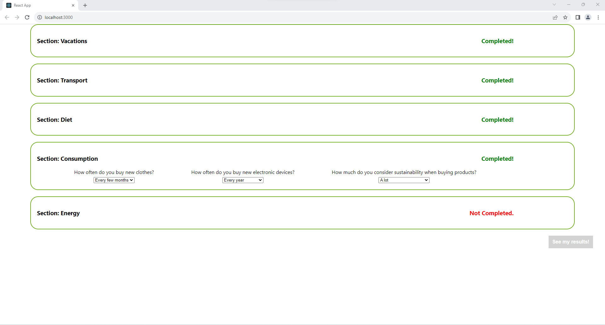
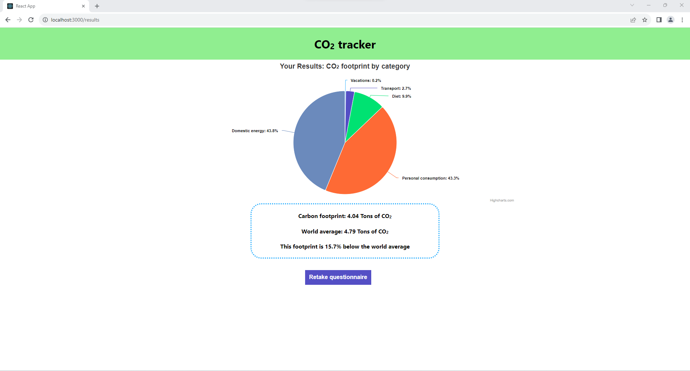
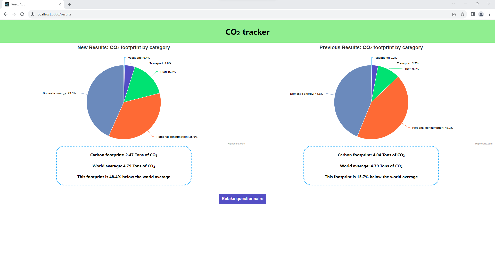

# CO<sub>2</sub> Tracker
A personal carbon footprint tracking app, created with JavaScript/React.

## Table of contents
* [Brief](#brief)
* [Images](#images)
* [Technologies](#technologies)
* [Setup](#setup)

## Brief
You have been approached by a lifestyle consultancy company dealing with environmental sustainability. Your task is to build a personal CO<sub>2</sub> footprint checker app that calculates a user's CO<sub>2</sub> footprint based on their lifestyle.

A user should be able to:

* Submit values for various aspects of their lifestyle (e.g. diet, commute, recycling and heating routine, holiday habits, etc) and view their CO<sub>2</sub> footprint. A simple model should be created to calculate this.
* Update the values to see the effect on their CO<sub>2</sub> footprint.
* View the CO<sub>2</sub> footprint result in a visually interesting way.

The app should be able to:

* Calculate and visualise projections of CO<sub>2</sub> savings based on a user's input.
* Show the CO<sub>2</sub> footprint result before and after the user has updated the values.

## Images






## Technologies
Project is created with:
* JavaScript
* React

## Setup
1. Ensure you have Node.js (20.1.0+) installed

2. Navigate to the app directory:
```
$ cd ../CO2_tracker
```

3. Install the dependencies and run the React app:
```
$ npm install
$ npm start
```

4. The app is now running on localhost:3000